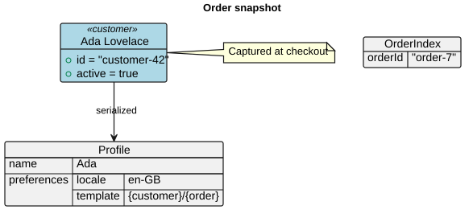

# uml

A MoonBit library that converts PlantUML source text to SVG, aiming to align
with PlantUML's behavior, including its layout.

The examples below illustrate the API. Gallery images in
[`__snapshot__/`](./__snapshot__/) are documentation assets, not byte-for-byte
SVG expectations in the test suite.

## Quick start

```bash
moon add kokic/uml
```

The facade package is `kokic/uml/api`. Its entry points are:

- `@api.render_svg(source)` — parse a PlantUML source and render it to SVG in
  one call.
- `@api.parse(source)` — parse only; returns a `Document` whose `kind()` names
  the diagram family the source selected.
- `Document::render_svg` — render an already parsed document.

```mbt nocheck
///|
let source =
  #|@startuml
  #|participant Alice
  #|Alice -> Bob : hello
  #|@enduml

///|
let svg = @api.render_svg(source)
```

## Gallery

### Sequence diagram

Participants and actors, activations, `autonumber`, `alt`/`else` groups, and
notes:

```mbt nocheck
///|
let source =
  #|@startuml
  #|autonumber
  #|actor User
  #|participant "Web App" as App
  #|participant "Auth Service" as Auth
  #|User -> App : sign in
  #|App -> Auth : POST /token
  #|activate Auth
  #|Auth --> App : access token
  #|deactivate Auth
  #|alt token granted
  #|App --> User : welcome page
  #|else invalid credentials
  #|App --> User : error message
  #|end
  #|note right of Auth : stateless issuer
  #|@enduml

///|
let svg = @api.render_svg(source)
```


### Class diagram

Interfaces, abstract classes, visibility markers, and relations:

```mbt nocheck
///|
let source =
  #|@startuml
  #|interface Shape {
  #|  + area() : Double
  #|}
  #|abstract class Polygon {
  #|  # vertices : Array[Point]
  #|  + area() : Double
  #|}
  #|class Circle {
  #|  - radius : Double
  #|  + area() : Double
  #|}
  #|class Point {
  #|  + x : Double
  #|  + y : Double
  #|}
  #|Shape <|.. Polygon
  #|Shape <|.. Circle
  #|Polygon o-- Point
  #|@enduml

///|
let svg = @api.render_svg(source)
```


### Object diagram

Objects with slots, map tables, JSON trees, notes and relations; the title
chrome renders above the content:

```mbt nocheck
///|
let source =
  #|@startuml
  #|title
  #|Order snapshot
  #|end title
  #|object "Ada Lovelace" as ada <<customer>> #lightblue {
  #|  + id = "customer-42"
  #|  + active = true
  #|}
  #|map OrderIndex {
  #|  orderId => "order-7"
  #|}
  #|json Profile {
  #|  "name": "Ada",
  #|  "preferences": {
  #|    "locale": "en-GB",
  #|    "template": "{customer}/{order}"
  #|  }
  #|}
  #|ada --> Profile : serialized
  #|note right of ada
  #|  Captured at checkout
  #|end note
  #|@enduml

///|
let svg = @api.render_svg(source)
```



### Use case diagram

Actors, use cases, and dotted relations:

```mbt nocheck
///|
let source =
  #|@startuml
  #|:Customer: --> (Browse catalog)
  #|:Customer: --> (Place order)
  #|:Sales clerk: --> (Approve order)
  #|(Place order) ..> (Approve order) : include
  #|@enduml

///|
let svg = @api.render_svg(source)
```


### Mindmap

`*` levels grow to the right, `--` levels grow to the left:

```mbt nocheck
///|
let source =
  #|@startmindmap
  #|* uml
  #|** Diagrams
  #|*** Sequence
  #|*** Class
  #|*** Use case
  #|** Formats
  #|*** JSON
  #|*** YAML
  #|*** TOML
  #|-- Backend
  #|--- SVG
  #|-- Tooling
  #|--- moon test
  #|@endmindmap

///|
let svg = @api.render_svg(source)
```


### JSON data diagram

```mbt nocheck
///|
let source =
  #|@startjson
  #|{
  #|  "name": "kokic/uml",
  #|  "version": "0.1.2",
  #|  "targets": ["wasm", "js", "native"],
  #|  "diagrams": {
  #|    "available": 7,
  #|    "planned": 3
  #|  }
  #|}
  #|@endjson

///|
let svg = @api.render_svg(source)
```


### YAML data diagram

```mbt nocheck
///|
let source =
  #|@startyaml
  #|name: uml
  #|license: Apache-2.0
  #|diagrams:
  #|  - sequence
  #|  - class
  #|  - mindmap
  #|render:
  #|  backend: svg
  #|  compatible: PlantUML
  #|@endyaml

///|
let svg = @api.render_svg(source)
```


### TOML data diagram

```mbt nocheck
///|
let source =
  #|@starttoml
  #|[package]
  #|name = "uml"
  #|version = "0.1.2"
  #|
  #|[render]
  #|backend = "svg"
  #|targets = ["wasm", "js"]
  #|@endtoml

///|
let svg = @api.render_svg(source)
```


### DOT diagram

`@startdot` forwards the DOT source to the shared graphviz engine, like
PlantUML does with the system `dot` executable:

```mbt nocheck
///|
let source =
  #|@startdot
  #|digraph G {
  #|  rankdir=LR;
  #|  a -> b -> c;
  #|  a -> c [label="direct"];
  #|}
  #|@enduml

///|
let svg = @api.render_svg(source)
```


## Theming

`render_svg` accepts a `color_scheme`. The two positional roles are the ink
colors (`text` and `line`); every other role is optional and may be a literal
color or a CSS variable such as `var(--uml-text)`, so one scheme can target a
specific light or dark page without touching each diagram. Document-level
`skinparam` lines still win over the scheme.

```mbt nocheck
///|
let dark = @style.ColorScheme::ColorScheme(
  "#e6edf3", // text
  "#8b949e", // line
  canvas="#0d1117",
  participant="#161b22",
  activation="#21262d",
  lifeline="#30363d",
  note="#2d2a1f",
)

///|
let source =
  #|@startuml
  #|participant "Web App" as App
  #|participant "Auth Service" as Auth
  #|App -> Auth : POST /token
  #|activate Auth
  #|Auth --> App : access token
  #|deactivate Auth
  #|note right of Auth : stateless issuer
  #|@enduml

///|
let svg = @api.render_svg(source, color_scheme=dark)
```


## Documents and diagram kinds

`parse` chooses the diagram family with the same per-line heuristics PlantUML
uses to pick a diagram factory, and `Document::kind` exposes the choice:

```mbt check
///|
test "documents expose their detected diagram kind" {
  let source =
    #|@startmindmap
    #|* root
    #|@endmindmap
  let document = @api.parse(source)
  assert_true(document.kind() is Mindmap)
}
```

## Collapsible class members

With `class_member_collapsible=true`, SVG member controls expose
`data-member-node`, `data-member-section`, and `aria-expanded`. The host
handles click or keyboard activation, updates `member_states` by qualified
node code, and calls the renderer again. Each call recomputes the full layout.
A standalone SVG shows its current state; interaction requires a host.

```mbt nocheck
///|
let source =
  #|@startuml
  #|class User {
  #|- secret
  #|}
  #|@enduml

///|
let svg = @api.render_svg(source, class_member_collapsible=true)
```

## Testing

`moon test` checks parsing semantics, data flow and geometry properties.
Gallery images are maintained separately; tests do not freeze their SVG markup.

## License

Apache-2.0
