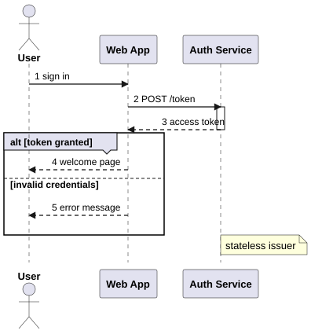
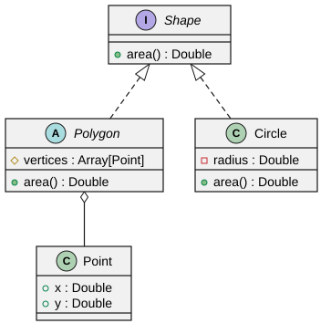
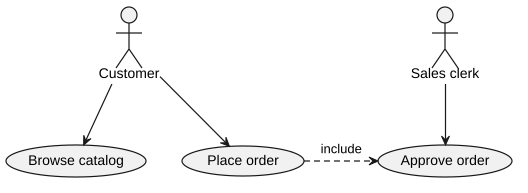
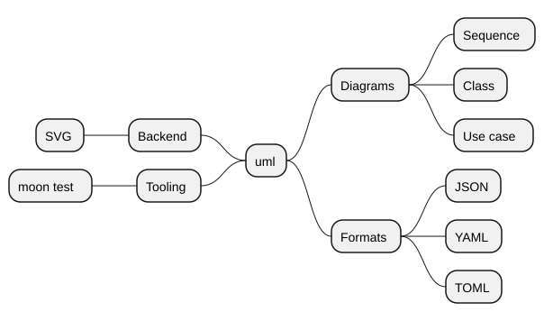
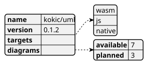
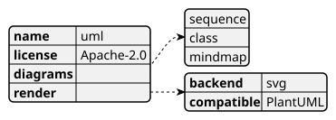
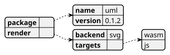
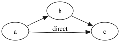
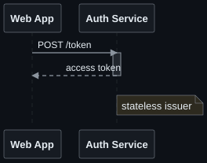

# uml

A MoonBit library that converts PlantUML source text to SVG, aiming to align
with PlantUML's behavior, including its layout.

This document is executable. Every example below is a real test that `moon test`
runs, and every image is the exact SVG those tests wrote into
[`__snapshot__/`](./__snapshot__/) with `moon test --update`. When rendering
changes, the pictures in this page change in the same commit.

## Quick start

```bash
moon add kokic/uml
```

The facade package is `kokic/uml/api`. Its entry points are:

- `@api.render_svg(source)` — parse a PlantUML source and render it to SVG in
  one call.
- `@api.parse(source)` — parse only; returns a `Document` whose `kind()` names
  the diagram family the source selected.
- `Document::render_svg` — render an already parsed document.

```mbt check
///|
test "quick start" {
  let source =
    #|@startuml
    #|participant Alice
    #|Alice -> Bob : hello
    #|@enduml
  let svg = @api.render_svg(source)
  assert_true(svg.contains("<svg"))
}
```

## Gallery

### Sequence diagram

Participants and actors, activations, `autonumber`, `alt`/`else` groups, and
notes:

```mbt check
///|
test "sequence diagram" (it : @test.Test) {
  let source =
    #|@startuml
    #|autonumber
    #|actor User
    #|participant "Web App" as App
    #|participant "Auth Service" as Auth
    #|User -> App : sign in
    #|App -> Auth : POST /token
    #|activate Auth
    #|Auth --> App : access token
    #|deactivate Auth
    #|alt token granted
    #|App --> User : welcome page
    #|else invalid credentials
    #|App --> User : error message
    #|end
    #|note right of Auth : stateless issuer
    #|@enduml
  it.write(@api.render_svg(source))
  it.snapshot(filename="sequence.svg")
}
```



### Class diagram

Interfaces, abstract classes, visibility markers, and relations:

```mbt check
///|
test "class diagram" (it : @test.Test) {
  let source =
    #|@startuml
    #|interface Shape {
    #|  + area() : Double
    #|}
    #|abstract class Polygon {
    #|  # vertices : Array[Point]
    #|  + area() : Double
    #|}
    #|class Circle {
    #|  - radius : Double
    #|  + area() : Double
    #|}
    #|class Point {
    #|  + x : Double
    #|  + y : Double
    #|}
    #|Shape <|.. Polygon
    #|Shape <|.. Circle
    #|Polygon o-- Point
    #|@enduml
  it.write(@api.render_svg(source))
  it.snapshot(filename="class.svg")
}
```



### Use case diagram

Actors, use cases, and dotted relations:

```mbt check
///|
test "use case diagram" (it : @test.Test) {
  let source =
    #|@startuml
    #|:Customer: --> (Browse catalog)
    #|:Customer: --> (Place order)
    #|:Sales clerk: --> (Approve order)
    #|(Place order) ..> (Approve order) : include
    #|@enduml
  it.write(@api.render_svg(source))
  it.snapshot(filename="usecase.svg")
}
```



### Mindmap

`*` levels grow to the right, `--` levels grow to the left:

```mbt check
///|
test "mindmap diagram" (it : @test.Test) {
  let source =
    #|@startmindmap
    #|* uml
    #|** Diagrams
    #|*** Sequence
    #|*** Class
    #|*** Use case
    #|** Formats
    #|*** JSON
    #|*** YAML
    #|*** TOML
    #|-- Backend
    #|--- SVG
    #|-- Tooling
    #|--- moon test
    #|@endmindmap
  it.write(@api.render_svg(source))
  it.snapshot(filename="mindmap.svg")
}
```



### JSON data diagram

```mbt check
///|
test "json diagram" (it : @test.Test) {
  let source =
    #|@startjson
    #|{
    #|  "name": "kokic/uml",
    #|  "version": "0.1.2",
    #|  "targets": ["wasm", "js", "native"],
    #|  "diagrams": {
    #|    "available": 7,
    #|    "planned": 3
    #|  }
    #|}
    #|@endjson
  it.write(@api.render_svg(source))
  it.snapshot(filename="json.svg")
}
```



### YAML data diagram

```mbt check
///|
test "yaml diagram" (it : @test.Test) {
  let source =
    #|@startyaml
    #|name: uml
    #|license: Apache-2.0
    #|diagrams:
    #|  - sequence
    #|  - class
    #|  - mindmap
    #|render:
    #|  backend: svg
    #|  compatible: PlantUML
    #|@endyaml
  it.write(@api.render_svg(source))
  it.snapshot(filename="yaml.svg")
}
```



### TOML data diagram

```mbt check
///|
test "toml diagram" (it : @test.Test) {
  let source =
    #|@starttoml
    #|[package]
    #|name = "uml"
    #|version = "0.1.2"
    #|
    #|[render]
    #|backend = "svg"
    #|targets = ["wasm", "js"]
    #|@endtoml
  it.write(@api.render_svg(source))
  it.snapshot(filename="toml.svg")
}
```



### DOT diagram

`@startdot` forwards the DOT source to the shared graphviz engine, like
PlantUML does with the system `dot` executable:

```mbt check
///|
test "dot diagram" (it : @test.Test) {
  let source =
    #|@startdot
    #|digraph G {
    #|  rankdir=LR;
    #|  a -> b -> c;
    #|  a -> c [label="direct"];
    #|}
    #|@enduml
  it.write(@api.render_svg(source))
  it.snapshot(filename="dot.svg")
}
```



## Theming

`render_svg` accepts a `color_scheme`. The two positional roles are the ink
colors (`text` and `line`); every other role is optional and may be a literal
color or a CSS variable such as `var(--uml-text)`, so one scheme can target a
specific light or dark page without touching each diagram. Document-level
`skinparam` lines still win over the scheme.

```mbt check
///|
test "dark sequence diagram" (it : @test.Test) {
  let dark = @style.ColorScheme::ColorScheme(
    "#e6edf3", // text
    "#8b949e", // line
    canvas="#0d1117",
    participant="#161b22",
    activation="#21262d",
    lifeline="#30363d",
    note="#2d2a1f",
  )
  let source =
    #|@startuml
    #|participant "Web App" as App
    #|participant "Auth Service" as Auth
    #|App -> Auth : POST /token
    #|activate Auth
    #|Auth --> App : access token
    #|deactivate Auth
    #|note right of Auth : stateless issuer
    #|@enduml
  it.write(@api.render_svg(source, color_scheme=dark))
  it.snapshot(filename="sequence_dark.svg")
}
```



## Documents and diagram kinds

`parse` chooses the diagram family with the same per-line heuristics PlantUML
uses to pick a diagram factory, and `Document::kind` exposes the choice:

```mbt check
///|
test "documents expose their detected diagram kind" {
  let source =
    #|@startmindmap
    #|* root
    #|@endmindmap
  let document = @api.parse(source)
  assert_true(document.kind() is Mindmap)
  assert_true(document.render_svg().contains("<svg"))
}
```

## Collapsible class members

With `class_member_collapsible=true`, class members render inside a
`<details>` disclosure (via `<foreignObject>`) so they can be folded in the
browser:

```mbt check
///|
test "collapsible class members" {
  let source =
    #|@startuml
    #|class User {
    #|- secret
    #|}
    #|@enduml
  let svg = @api.render_svg(source, class_member_collapsible=true)
  assert_true(svg.contains("<details"))
}
```

## Snapshot workflow

The images in this page are ordinary snapshot tests:

```bash
moon test          # verifies the SVGs are unchanged
moon test --update # regenerates __snapshot__/*.svg after a rendering change
```

## License

Apache-2.0
